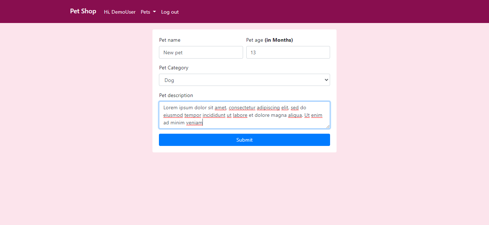
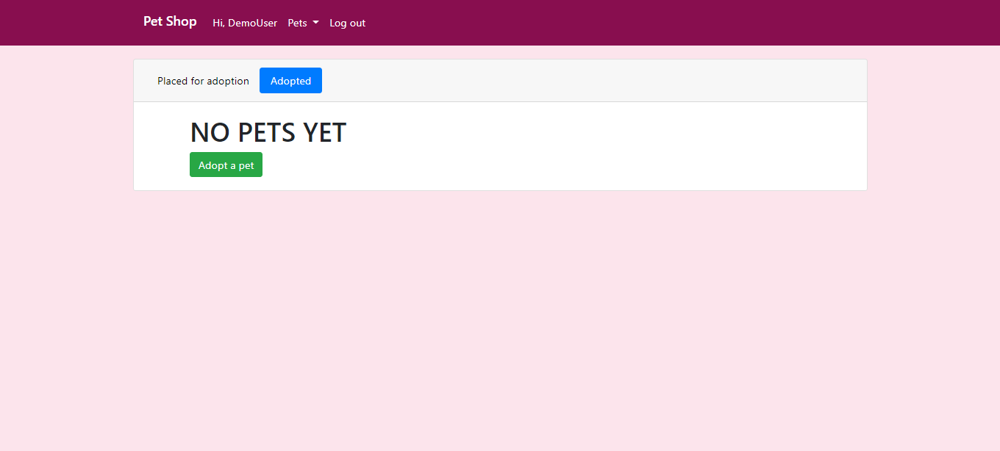

# PET SHOP🐶

Pets shop is a simple **PHP CRUD** application for adopting pets.

 Users log into the site, browse through the available pets, chose a pet and adopt one.

Users can as well place a pet for adoption and vice versa.

## Languages and Technologies 🛠

* HTML
* CSS
* JavaScript
* PHP
* MySQL

## Requirements 
* [xampp](https://www.apachefriends.org/index.html) or [wamp server](https://sourceforge.net/projects/wampserver/) or [mamp](https://www.mamp.info/en/windows/)

> In this documentation we'll be using xampp

## Installation 💾
1. Clone the [project](https://github.com/JacobJax/pet-shop.git) to **htdocs** folder in xampp by running: 
`git clone https://github.com/JacobJax/pet-shop.git`

1. Open xampp and start *Apache* and *MySQL*

1. On the browser, navigate to `http://localhost/phpmyadmin/` 

1. Click on *import* then *choose file*. Nacigate to `C:\\xampp\htdocs\pet-shop\` and select _**petshop_mgt.sql**_ 

1. Run the sql file to create the database and its entries

1. You can then open the project in the browser on `http://localhost/pet-shop/public/index.php`

 

## Register and Log in
The index page allows you to view a list of pets but will not let you adopt any without an account.

On the log in page, click on `Register here` and enter your details then click `Register` to create an account

You'll then be directed to the login page where you enter your log in details and click `Log in`

Logging in directs you to the homepage.

 

## Adopt a Pet

To adopt a pet, click of a pet of your choice.

On the page, click on `Confirm adoption`

 

## Placing a pet for adoption

To place a pet for adoption, click on the `Pets` dropdown and select `Place for adoption`

Enter the pet details then click `Submit`

This will redirect you to the pets view page

> **NOTE**
>
> You can always navigate to this page by clicking on the `Pets` Dropdown and selecting `Your pets`

 

## Updating pet details

On the pets view page, click on `Edit` on the pet you'd like to update.

Enter the new pet details and then click `Submit`

 

## Delete a pet

On the pets view page, click on `Delete` on the pet you'd like to update.

 

## Unadopt a pet

Stil on the pets view page, click on `Adopted`.

Click on `Unadopt` to complete unadoption

 

### Future Improvements 🏗 

1. **M-Pesa daraja API intergration** - The project would go well with inclusion of payment service from example MPESA

1. **Handle database race condition** - An improvement on the project would be to handle a race condition caused by two users chosing the same pet at the same time

1. **Include Pictures**(Comming soon) - Pictures will be a good adition to the UI/UX

Feel free to clone or fork the project and use it to build something cool.

